# INFRASTRUCTURE ET DEVOPS
Mathys Farineau  -  M2 IW
 
## PROJET - Docker Swarm

docker swarm join --token SWMTKN-1-5svp4j813xmq52s9dd0qa686laz8558l0s4mrc96xxtevtpsgo-5j4l9otdgqbzhcm4f4fp5v2ix 172.25.0.3:2377

### Exercice 2 - Création du cluster Docker Swarm

Création du compose initial

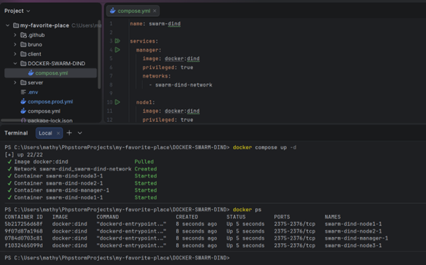

Initialisation de docker swarm dans le container manager

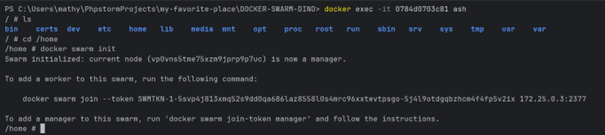

Ajout des 3 nœuds workers dans le cluster

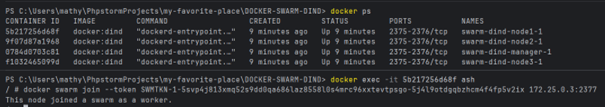
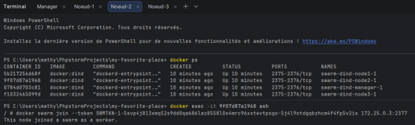
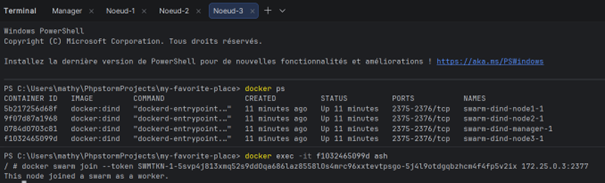

Vérification dans le Manager que tout est OK

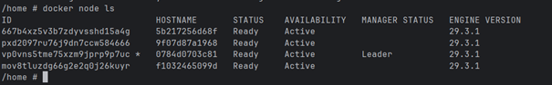

---

### Exercice 3 - Tests du cluster

Pour plus de simplicité, je crée le compose avec mon éditeur, puis je le copie dans le container manager

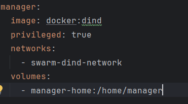
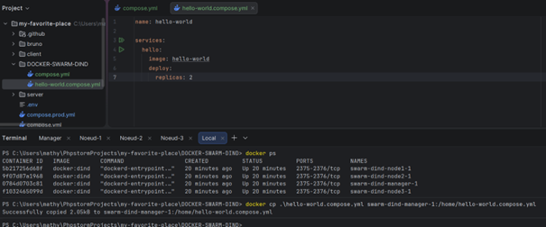
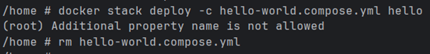

Apparemment on ne peut pas mettre de name, je recommence la manip sans le name dans le compose.

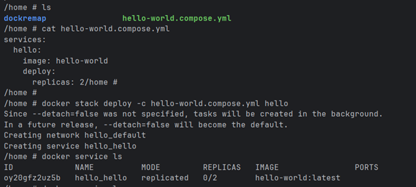

Problème : les réplicas ne marchent pas.

Pourquoi ? J'imagine que c'est car l'image hello world affiche juste hello world et s'arrête. Donc une fois arrêté, les
réplicas s'arrêtent également.

Vu en cours, on va utiliser l'image nmatsui/hello-world-api qui affiche hello world et reste en écoute.

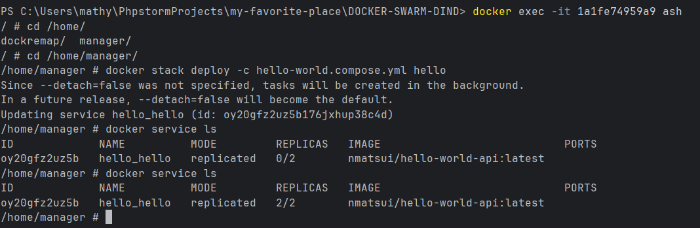

Pour faire varier, je peux rajouter 
```
placement:
        constraints:
          - node.role == manager
```


ou bien 

```
deploy:
      mode: global
```

La première variante ne déploie que sur le manager, tandis que la seconde déploie sur tous les workers.

---

### Exercice 4 - Premiers tests Ansible

1.
Pour lancer la stack avec 3 noeud, je peux utiliser la commande :

```
docker compose up -d --scale node=3
```

Si je fais docker ps, j'ai bien :

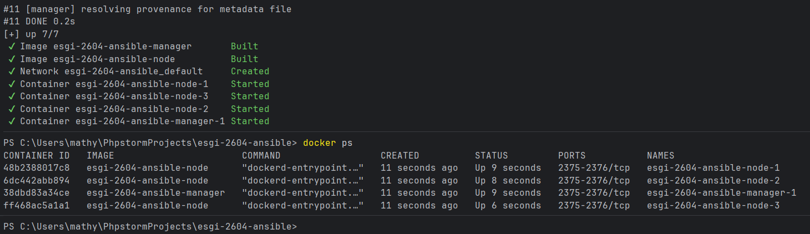


2.
Le playbook automatise les commandes swarm que l'on a fait juste avant. Il fait un swarm init, puis il fait join les worker dedans

Sous Windows, j'install ansible puis le plugin docker :
```
pip install ansible

ansible-galaxy collection install community.docker
```

Ca ne marche pas sous windows. Du coup, je l'installe dans ma distribution Ubuntu WSL2.

J'ai des problèmes à l'exécution de l'inventaire donc j'ajoute un fichier de config.

```
[defaults]
remote_tmp = /tmp/.ansible/tmp
```

Ca ne marche toujours pas donc je copie le projet dans wsl complètement.

Après beaucoup de manipulations j'ai enfin réussi à exécuter l'inventaire :

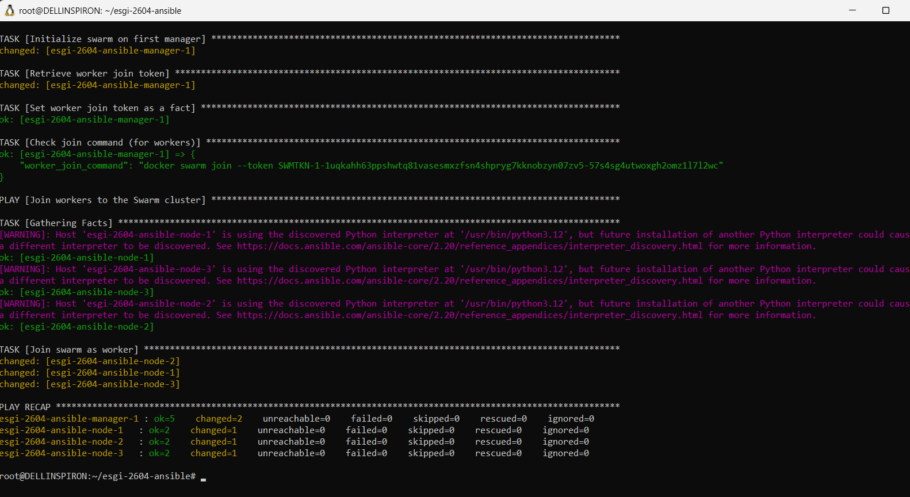


Ca a l'air de bien marcher :

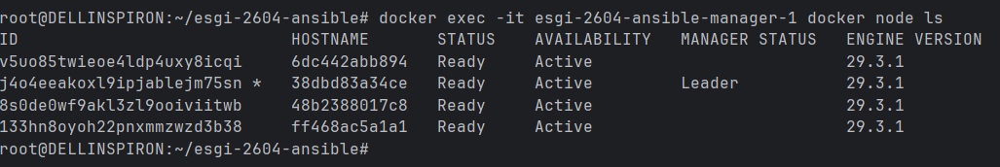

Si je relance, j'observe que ce n'est plus en changed mais en ok, car rien n'a changé.


---

### Exercice 5 - Comprendre Ansible

1.
J'ajoute un noeud supplémentaire :

```
docker compose up -d --scale node=4
```


Puis je le met dans l'inventaire :

esgi-2604-ansible-node-4

Je vois que les 3 anciens sont intacts et que le nouveau a bien été ajouté.


2.
Pour adapter pour des VMs/VPS en SSH, il faudrait ajouter les IP pour le manager et les workers. Aussi, il faudrait ajouter des clés pour le ssh dans l'inventaire.

Dans le playbook, on devrait modifier les commandes pour ajouter l'adresse. Par exemple, 
```text
command: "docker swarm init"
```
devient : 

```text
command: "docker swarm init --advertise-addr {{ ansible_host }}"
```

Ou par exemple :

```text
command: "{{ hostvars[groups['managers'][0]]['worker_join_command'] }} manager:2377"
```

devient :
```text
command: "{{ hostvars[groups['managers'][0]]['worker_join_command'] }} {{ hostvars[groups['managers'][0]]['ansible_host'] }}:2377"
```

4

De ce que j'ai compris, Terraform sert à "provisionner" l'infra. Il va créer les ressources cloud (VMs, réseaux, load balancers, DNS...) chez des fournisseurs comme AWS, GCP ou Azure. Il parle à des APIs cloud pour faire apparaître des machines de zéro.

Ansible, lui,  sert à configurer ce qui tourne sur cette infrastructure : une fois les machines créées par Terraform, Ansible s'y connecte en SSH pour installer Docker, configurer des services, déployer des applications, etc.


### Exercice 6 - Traefik et Portainer

1. On crée le réseau en mode overlay

/ # docker network create -d overlay web 
82y2q45c3k1pd1vm3kz3jtpki

2. On déploie la stack

docker compose up
[+] up 13/13
 ✔ Image traefik/whoami        Pulled                                                                                   2.7s
 ✔ Image traefik:v3.6          Pulled                                                                                  12.5s
 ✔ Container traefik-whoami-1  Created                                                                                  0.2s
 ✔ Container traefik-traefik-1 Created                                                                                  0.2s
Attaching to traefik-1, whoami-1
Error response from daemon: failed to set up container networking: Could not attach to network web: rpc error: code = PermissionDenied desc = network web not manually attachable
/ # docker stack deploy -c docker-compose.yml traefik
(root) Additional property name is not allowed
/ # docker stack deploy -c docker-compose.yml traefik
Since --detach=false was not specified, tasks will be created in the background.
In a future release, --detach=false will become the default.
Creating service traefik_traefik
Creating service traefik_whoami


Je me rend compte qu'il faut aussi exposer les ports dans le compose de base :
    ports:
      - "8000:80"
      - "8080:8080"


Si je relance la stack et que je vais sur 
http://traefik.swarm.localhost:8000

J'ai :
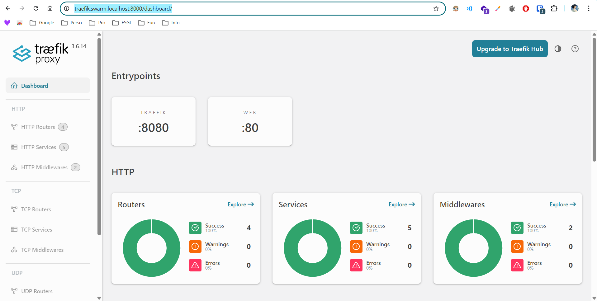

Si je vais sur 
http://whoami.swarm.localhost:8000/


J'ai :
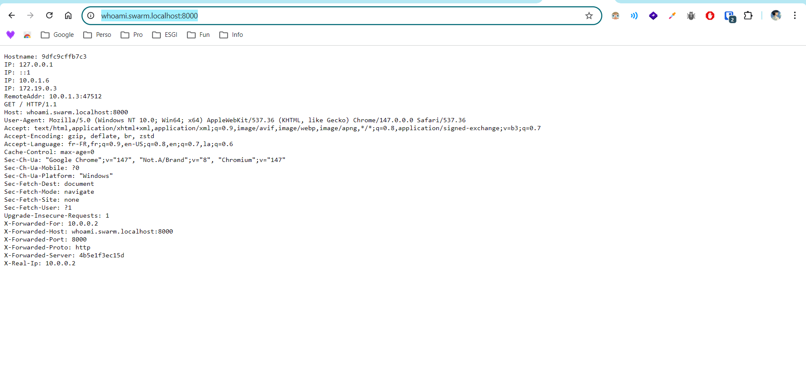


3. Concernant l'application de vote, malgré avoir modifié le compose de mon manager, j'ai un problème. Les images n'arrivent pas à se pull.
Si je vais sur les bonnes urls, j'ai 404.


Le problème vient de "No sush image". J'ai donc créé un script afin de simplifier le pull des images

Le but de ce script est de pré pull les images sur mes nodes. Important, il faut que je me docker login sur chacun de mes noeuds, sinon j'atteins la limite de pull.

```bash
for node in ansible-manager-1 ansible-node-1 ansible-node-2 ansible-node-3; do
  for image in redis:alpine postgres:15-alpine dockersamples/examplevotingapp_vote dockersamples/examplevotingapp_result dockersamples/examplevotingapp_worker; do
    echo "Pulling $image on $node..."
    docker exec $node docker pull $image
  done
done
```

Une fois que tout est pull, je retourne sur mon manager et je fais un stack deploy.

Si je vais sur 
http://vote.swarm.localhost:8000/

J'ai :
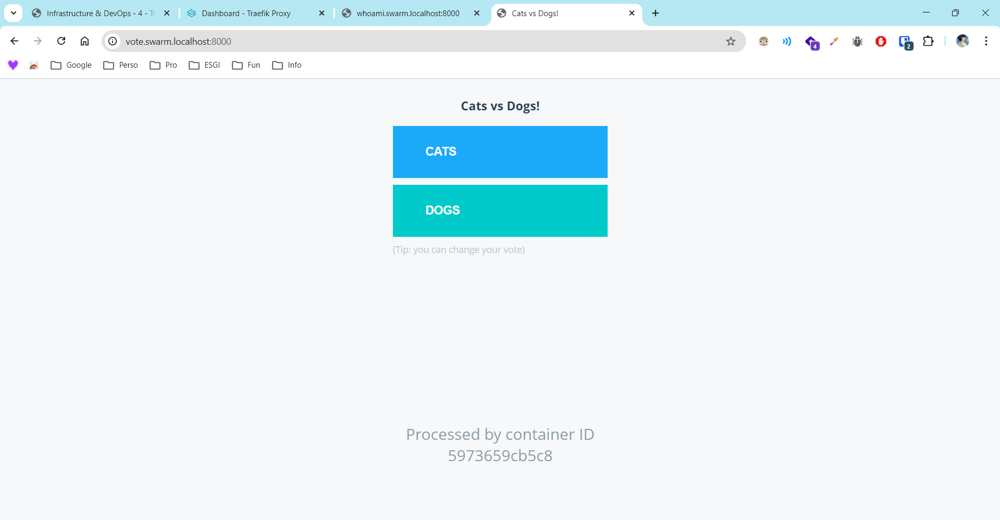

Si je vais sur 
http://result.swarm.localhost:8000/


J'ai :
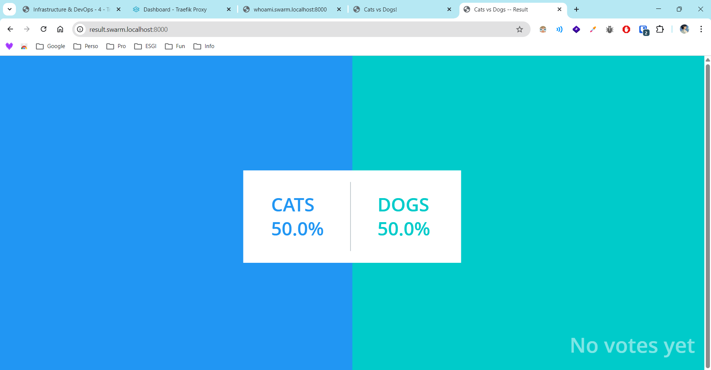
